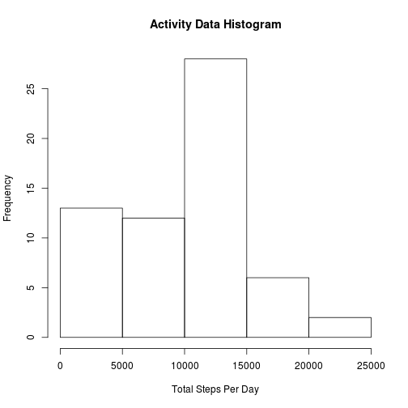
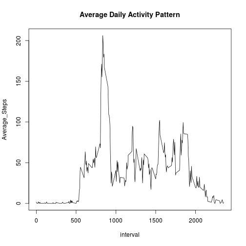
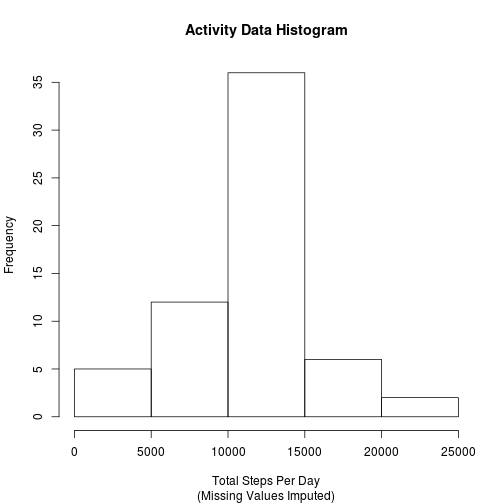
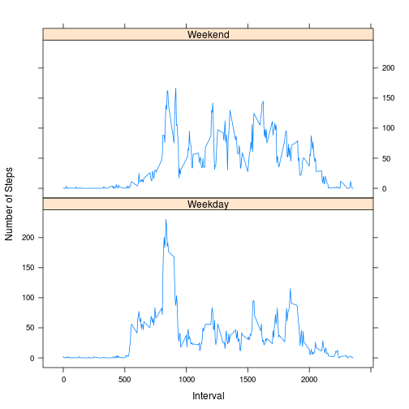

###Loading and preprocessing the data

```r
#read activity data file which has been unzipped into the directory below
#would be cool to find how to read directly from the original zip in github
setwd("/home/adrian/Rep_Research")
df.activity <- read.csv("activity.csv", header=TRUE, sep=",")
```

###What is mean total number of steps taken per day?

```r
#Aggregate activity by date, finding sum of steps per day (ignoring NA as instructed)
df.activity_sum <-setNames(aggregate(x=df.activity$steps, by=list(df.activity$date), FUN="sum", na.rm=TRUE), c("Date", "Total_Steps"))
hist(x=df.activity_sum$Total_Steps, xlab = "Total Steps Per Day", main = "Activity Data Histogram")
```

 


```r
#Calculate mean of Total Steps per day, ignoring NA values
mean_steps<-mean(df.activity_sum$Total_Steps, na.rm=TRUE)
#Calculate median of Total Steps per day, ignoring NA values
median_steps<-median(df.activity_sum$Total_Steps, na.rm=TRUE)
```

The mean of the total steps taken per day in this data set is 9354.2.

The median of the total steps taken per day in this data set is 10395.

###What is the average daily activity pattern?

```r
#Aggregate activity by date, finding sum of steps per day (ignoring NA as instructed)
df.activity_interval <-setNames(aggregate(x=df.activity$steps, by=list(df.activity$interval), FUN="mean", na.rm=TRUE), c("interval", "Average_Steps"))

plot(df.activity_interval, type="l", main = "Average Daily Activity Pattern")
```

 

The 5-minute interval which, on average across all the days in the dataset, contains the maximum number of steps, is 835

###Imputing missing values

The total number of missing values in the dataset (where step count appears as NA) is 
2304

Missing values are replaced with the mean steps for that interval.


```r
#The adjusted data frame is df.activity_adj
df.activity_adj<-merge(df.activity, df.activity_interval)

df.activity_adj$steps <- ifelse(is.na(df.activity_adj$steps), df.activity_adj$Average_Steps,                              df.activity_adj$steps) 

df.activity_adj_sum <-setNames(aggregate(x=df.activity_adj$steps, by=list(df.activity_adj$date), FUN="sum"), c("Date", "Total_Steps"))
hist(x=df.activity_adj_sum$Total_Steps, xlab = "Total Steps Per Day", main = "Activity Data Histogram", sub="(Missing Values Imputed)")
```

 


```r
#Calculate mean of Total Steps per day, ignoring NA values
mean_steps_adj<-mean(df.activity_adj_sum$Total_Steps)
#Calculate median of Total Steps per day, ignoring NA values
median_steps_adj<-median(df.activity_adj_sum$Total_Steps)

Adjustment_Impact_Mean <- mean_steps - mean_steps_adj
Adjustment_Impact_Median <- median_steps - median_steps_adj
```

The adjusted mean of the total steps taken per day in this data set is 10766.

The adjusted median of the total steps taken per day in this data set is 10766.

The impact of the adjustment on the mean equals to -1412 steps.
(Original Mean - Adjusted Mean)

The impact of the adjustment on the mean equals to -371.19 steps.
(Original Median - Adjusted Median)

###Are there differences in activity patterns between weekdays and weekends?


```r
df.activity_adj$Weekday<-weekdays(as.Date(df.activity_adj$date))
df.activity_adj$Day_Type <-as.factor(ifelse(weekdays(as.Date(df.activity_adj$date)) %in% c("Saturday", "Sunday"), "Weekend", "Weekday"))
```

Time series plot showing average number of steps taken, averaged across all weekday days or weekend days.


```r
#Prepare panel plot
library(lattice)
df.activity_adj_sum_by_Day_Type<-setNames(aggregate(x=df.activity_adj$steps,
by=list(df.activity_adj$interval, df.activity_adj$Day_Type), FUN="mean"), c("Interval", "Day_Type", "Average_Steps"))

#attach(df.activity_adj_sum_by_Day_Type)

xyplot(df.activity_adj_sum_by_Day_Type$Average_Steps ~          df.activity_adj_sum_by_Day_Type$Interval|df.activity_adj_sum_by_Day_Type$Day_Type, 
type="l", ylab = "Number of Steps", xlab = "Interval", layout = c(1, 2))
```

 
